# 1-俯卧撑

## 锻炼的主要肌肉群
- 胸肌（胸大肌和胸小肌）
- 三角肌前束
- 肱三头肌

## 十式
|等级|名称|训练目标|图例|
|-|-|-|-|
|一|墙壁俯卧撑|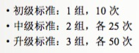|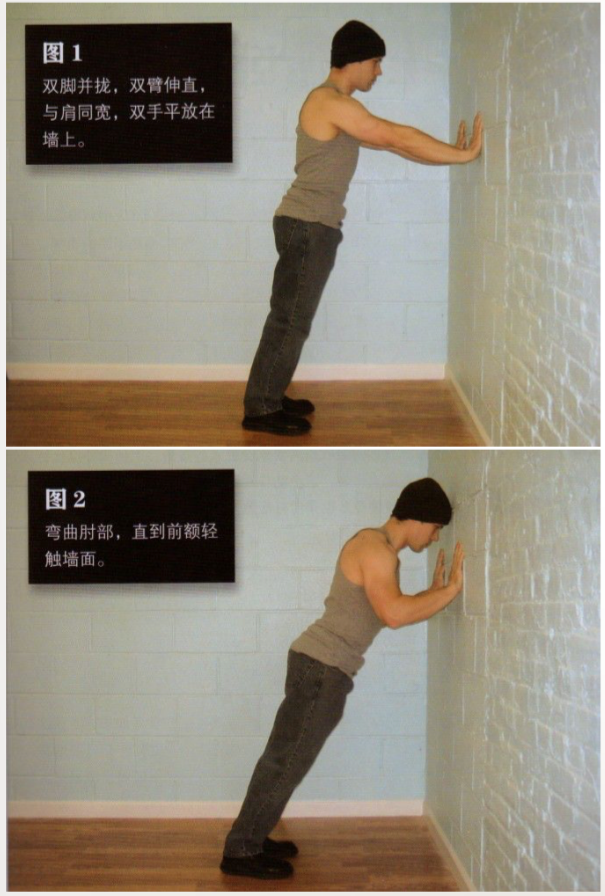|
|二|上斜俯卧撑|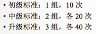|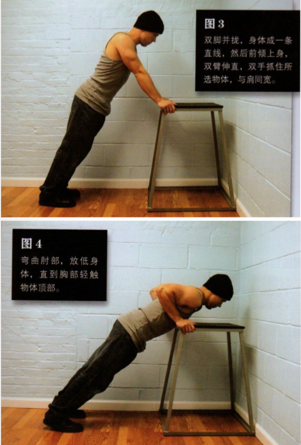|
|三|膝盖俯卧撑|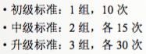|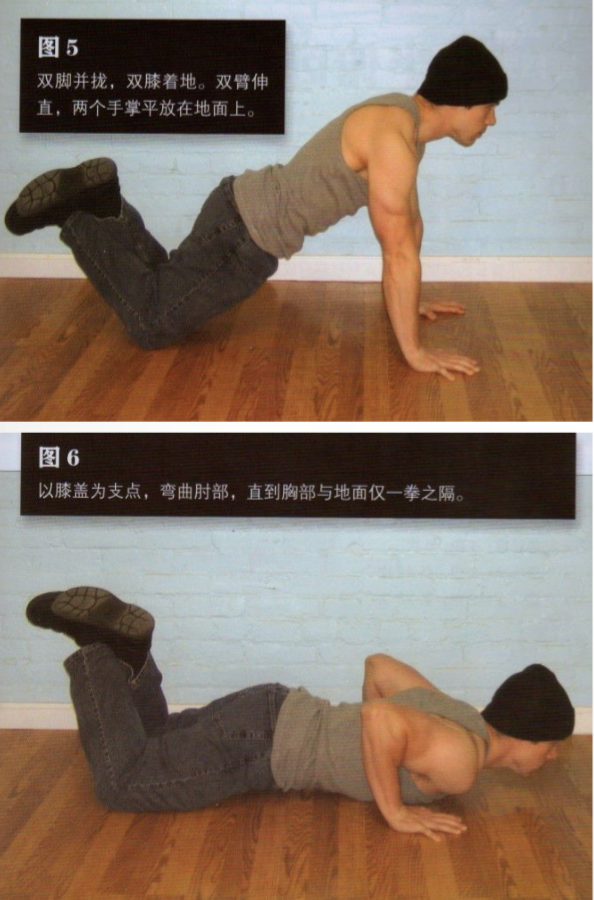|
|四|半俯卧撑||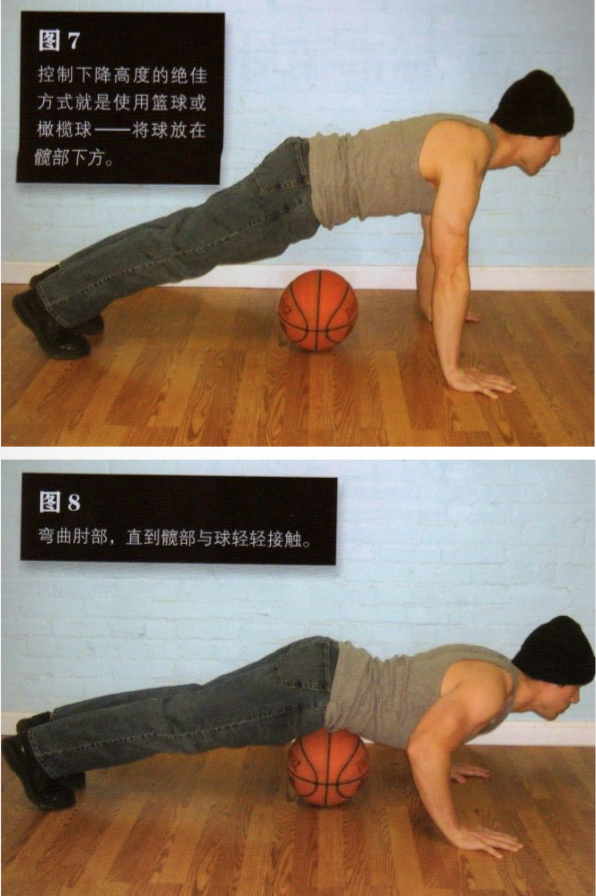|
|五|标准俯卧撑|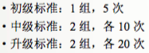|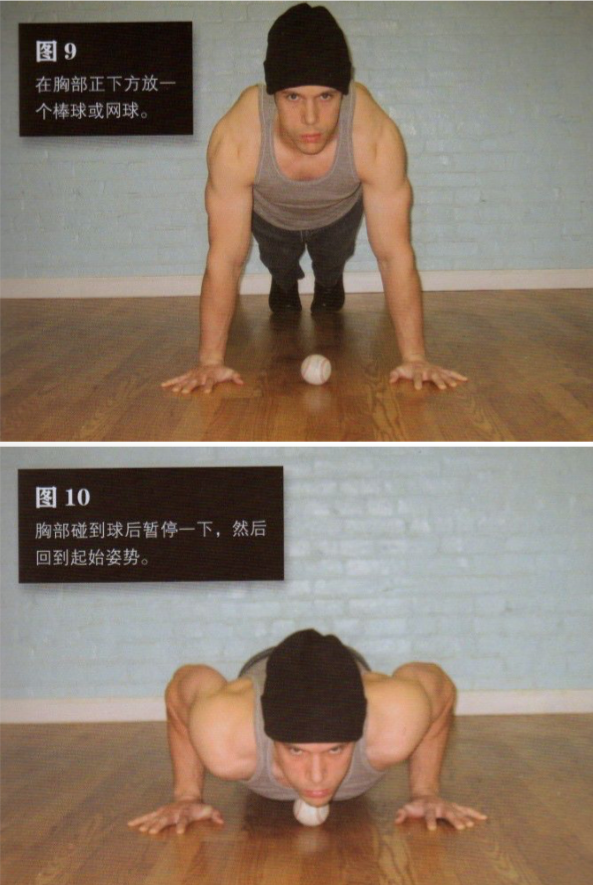|
|六|窄距俯卧撑||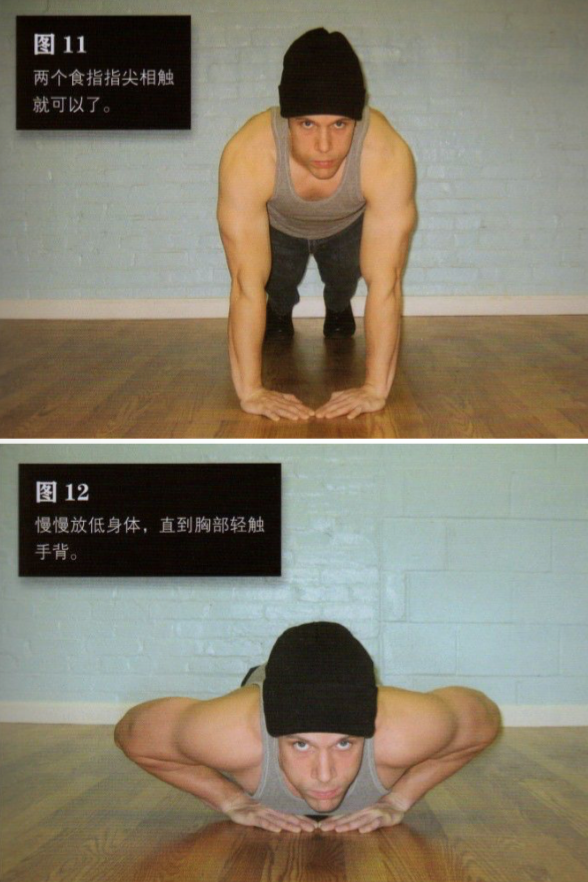|
|七|偏重俯卧撑|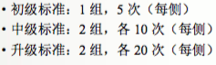|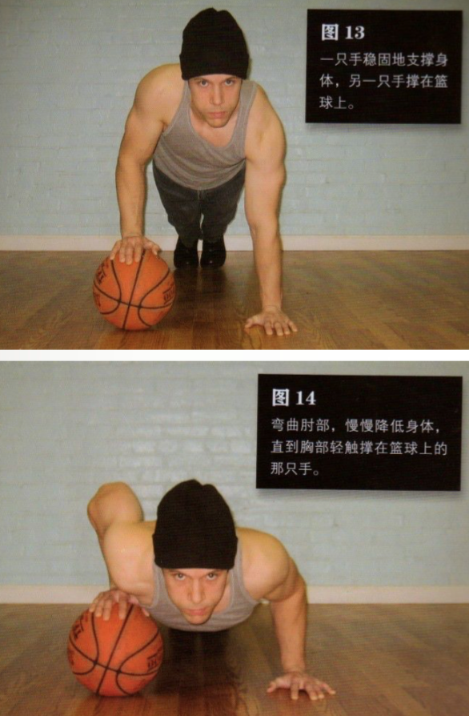|
|八|单臂半俯卧撑|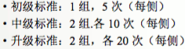|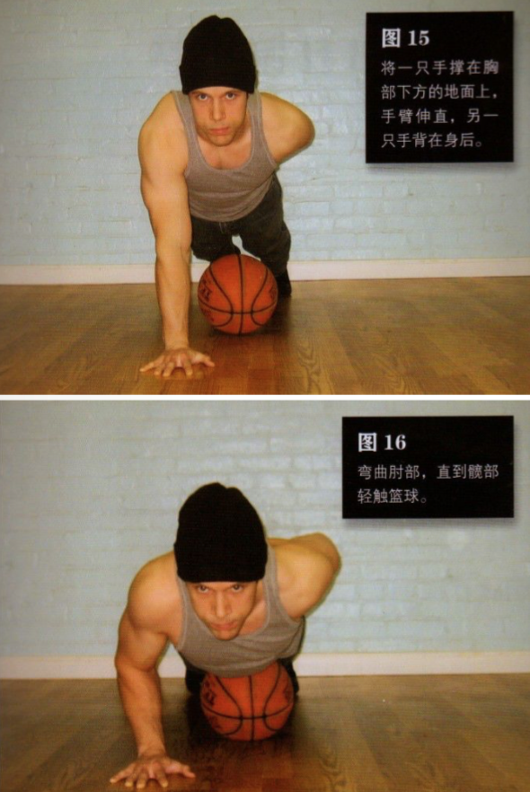|
|九|杠杆俯卧撑|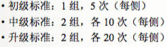|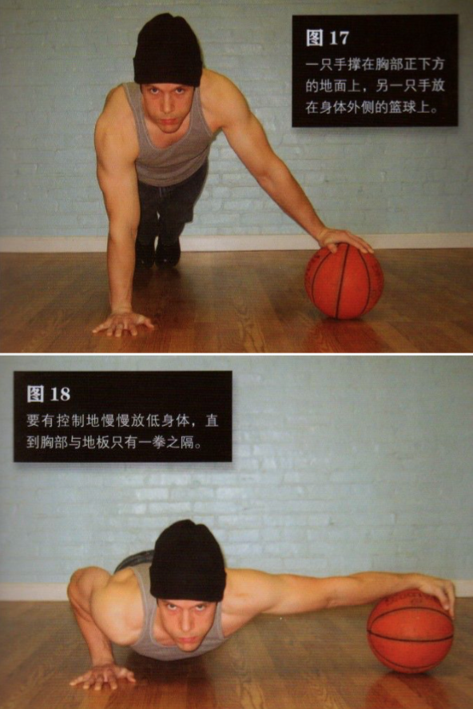|
|十|单臂俯卧撑||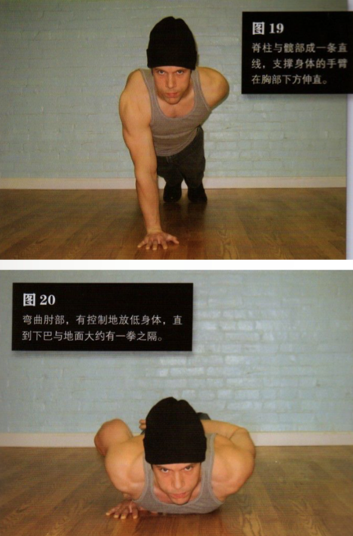|
