# 2-深蹲

## 锻炼的主要肌肉群
- 肱四头肌
- 臀肌
- 绳肌
- 大腿内侧肌肉
- 髋部
- 小腿
- 双脚

## 十式
|等级|名称|训练目标|图例|
|---|---|---|---|
|一|肩倒立深蹲|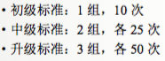|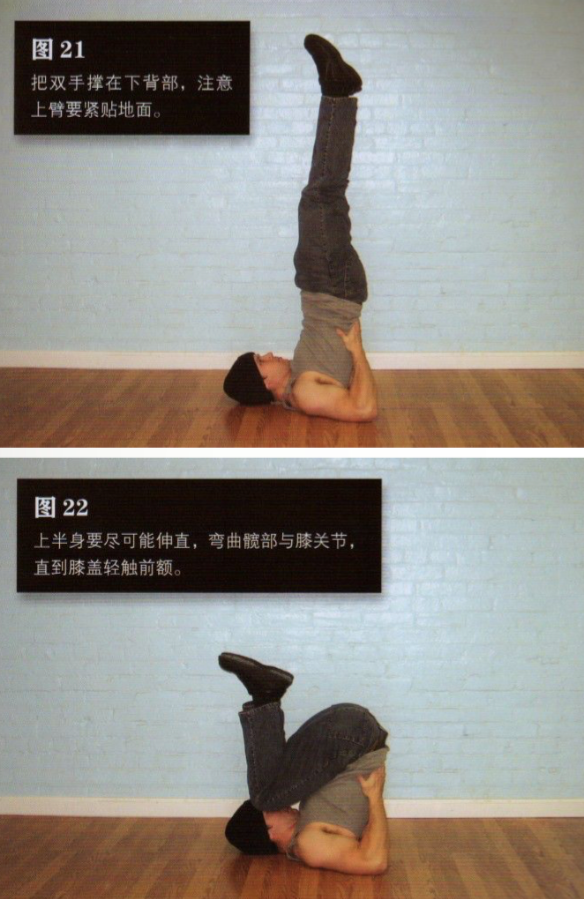|
|二|折刀深蹲|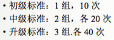|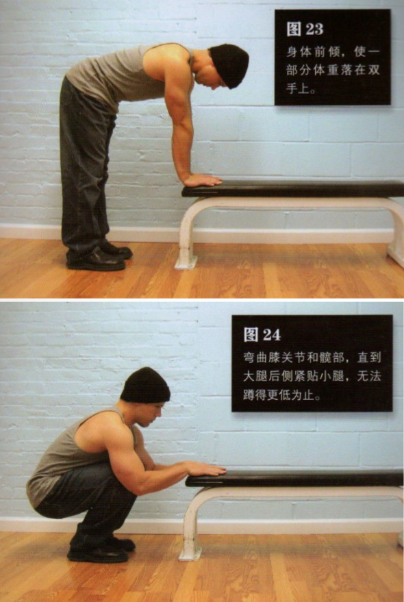|
|三|支撑深蹲|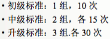|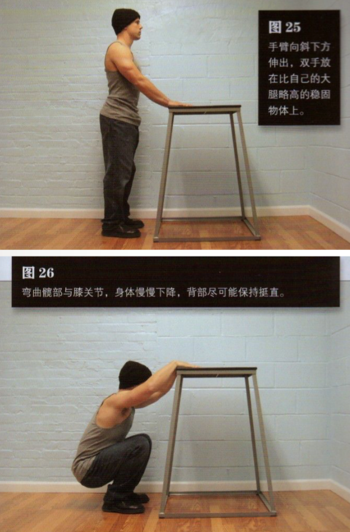|
|四|半深蹲|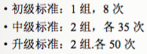|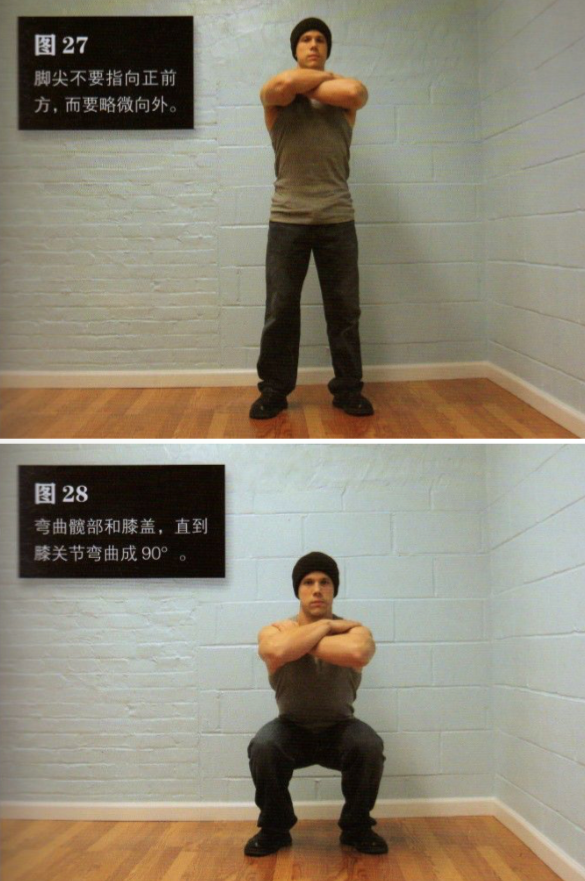|
|五|标准深蹲|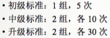|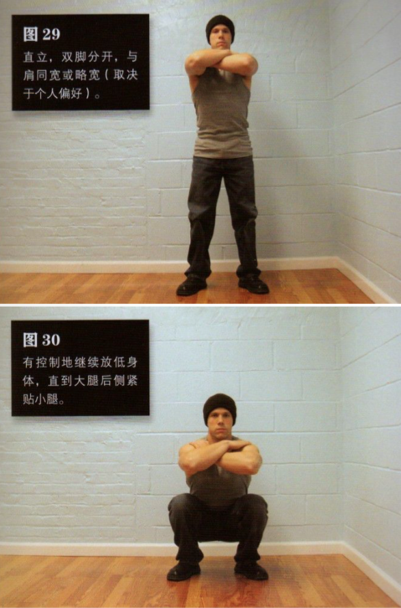|
|六|窄距深蹲|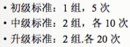|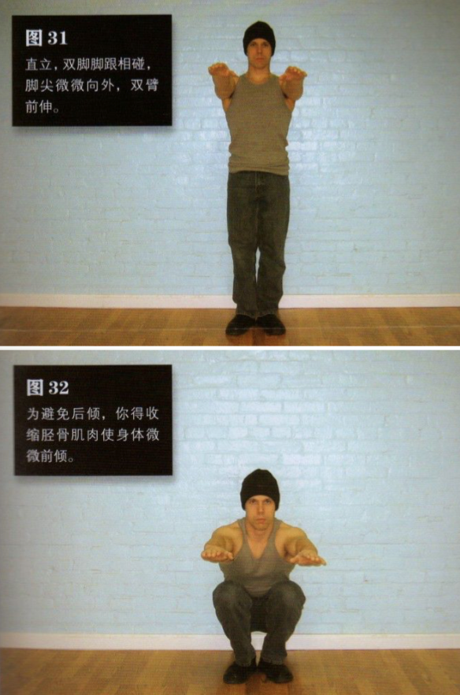|
|七|偏重深蹲|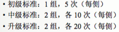|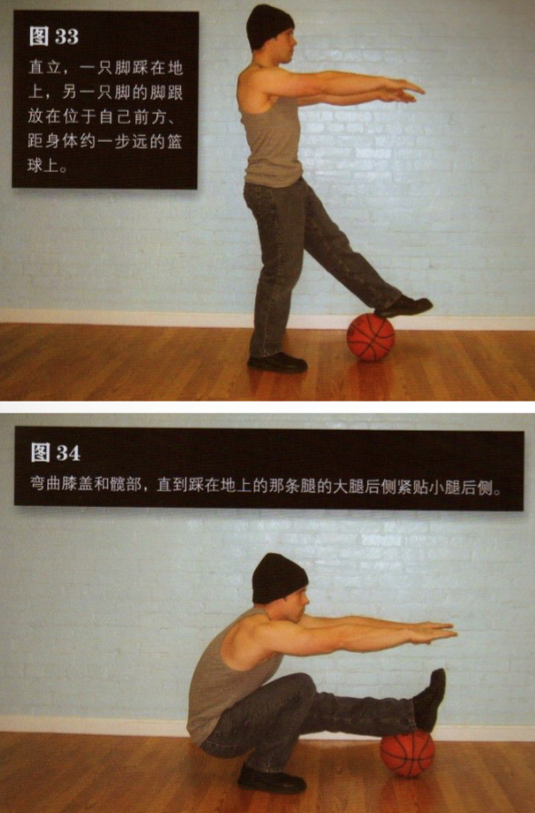|
|八|单腿半深蹲|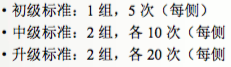|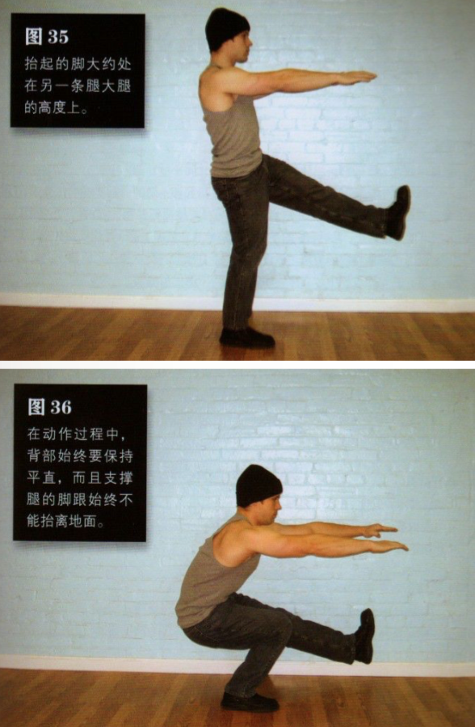|
|九|单腿辅助深蹲|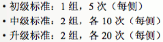|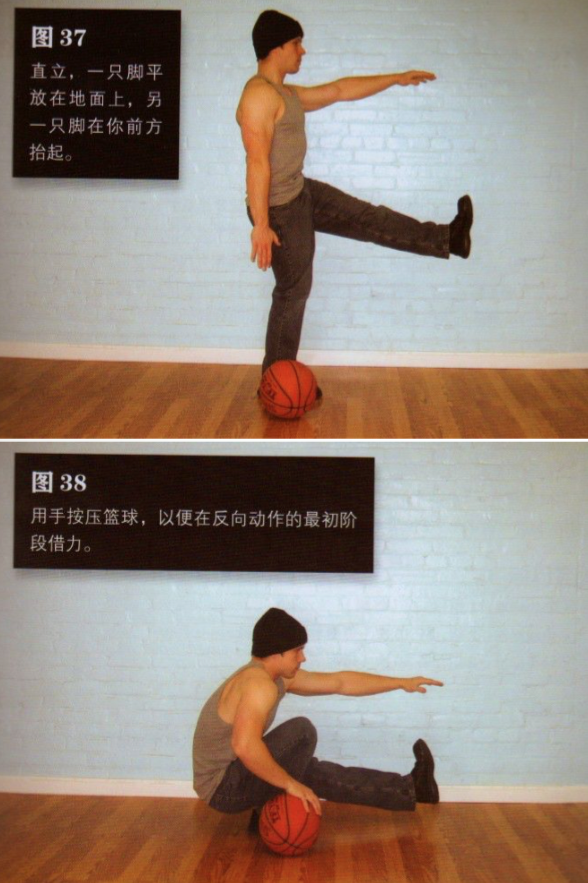|
|十|单腿深蹲|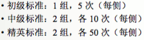|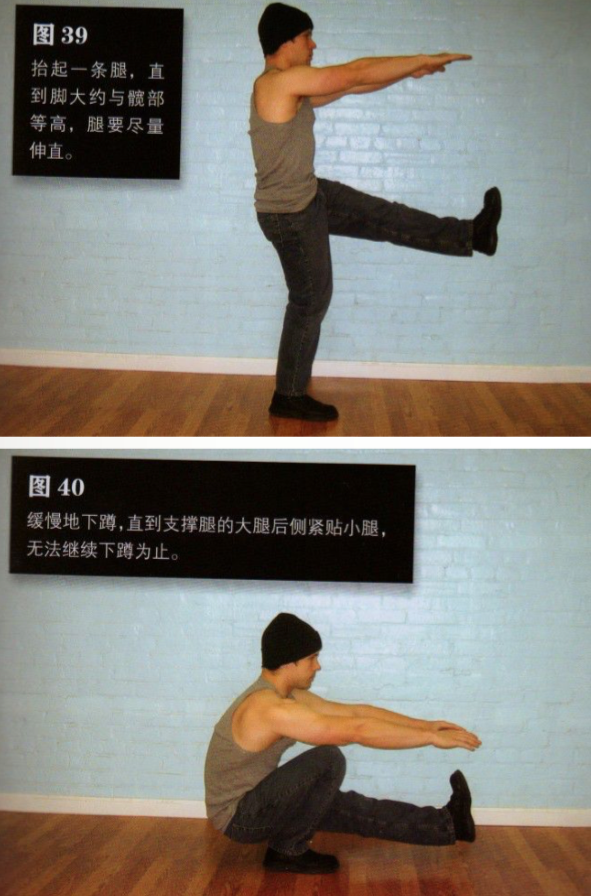|
