# 3-引体向上

## 锻炼的主要肌肉群
- 背阔肌
- 大圆肌
- 菱形肌
- 斜方肌
- 肱二头肌
- 前臂
- 双手

## 十式
|等级|名称|训练目标|图例|
|-|-|-|-|
|一|垂直引体|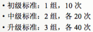|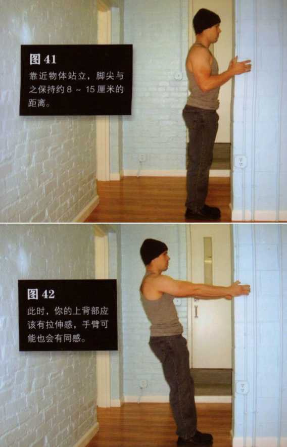|
|二|水平引体向上|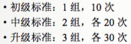|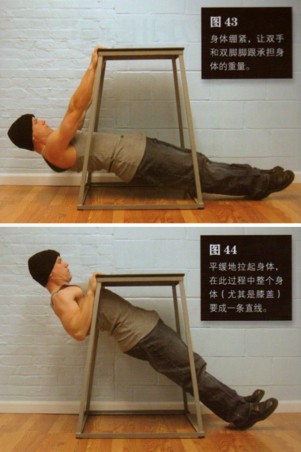|
|三|折刀引体向上|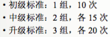|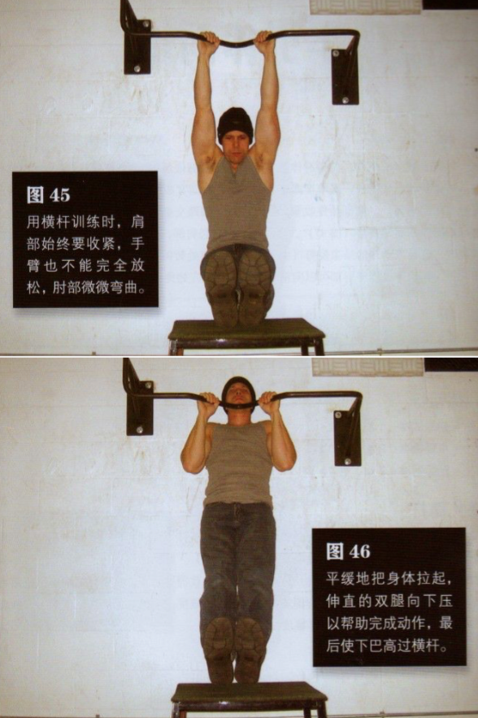|
|四|半引体向上|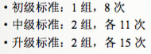|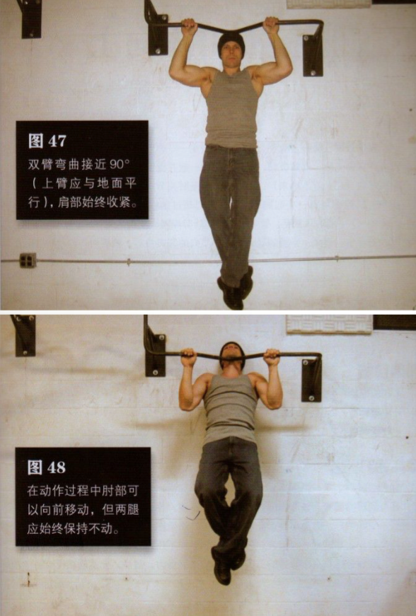|
|五|标准引体向上|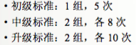|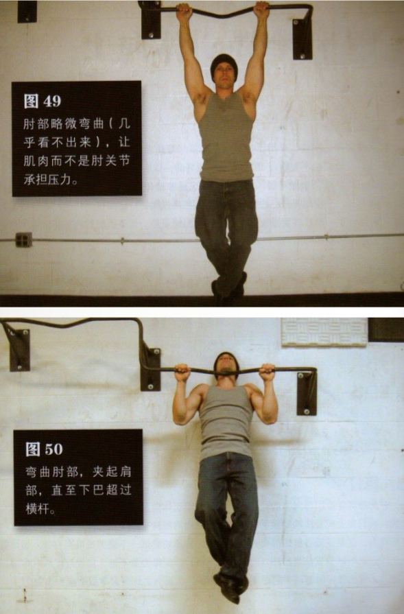|
|六|窄距引体向上|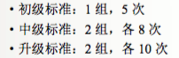|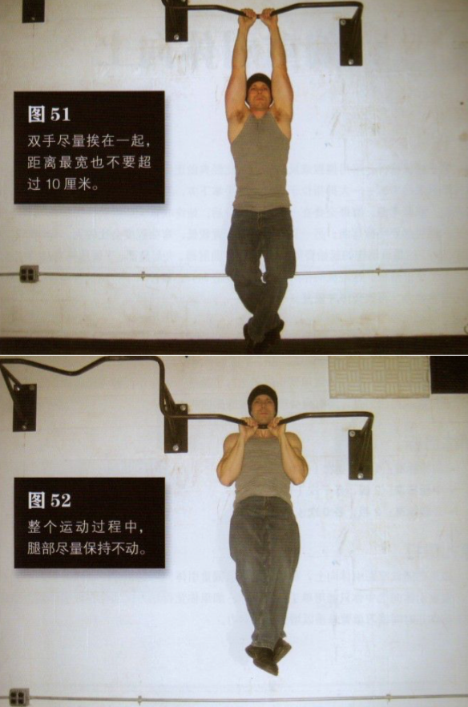|
|七|偏重引体向上|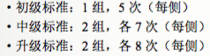|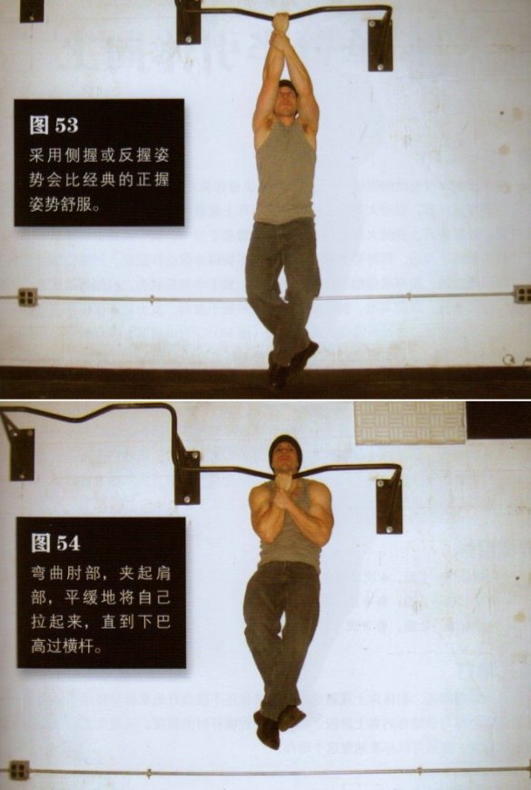|
|八|单臂半引体向上|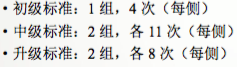|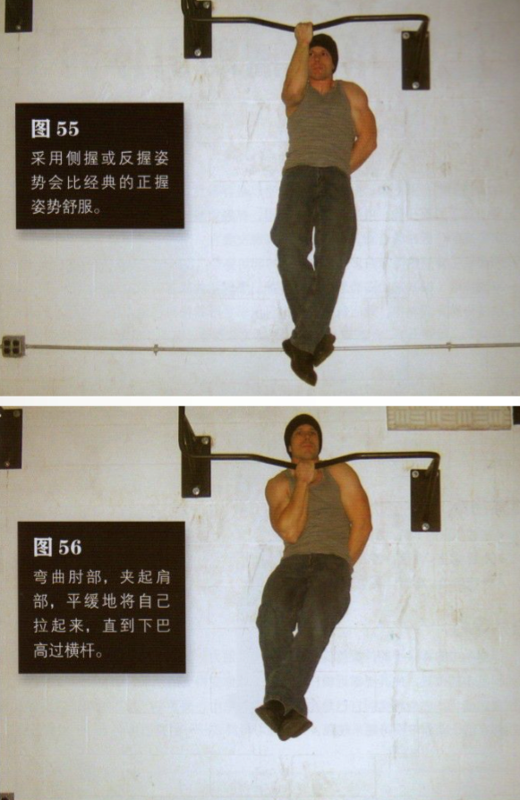|
|九|单臂辅助引体向上|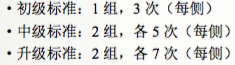|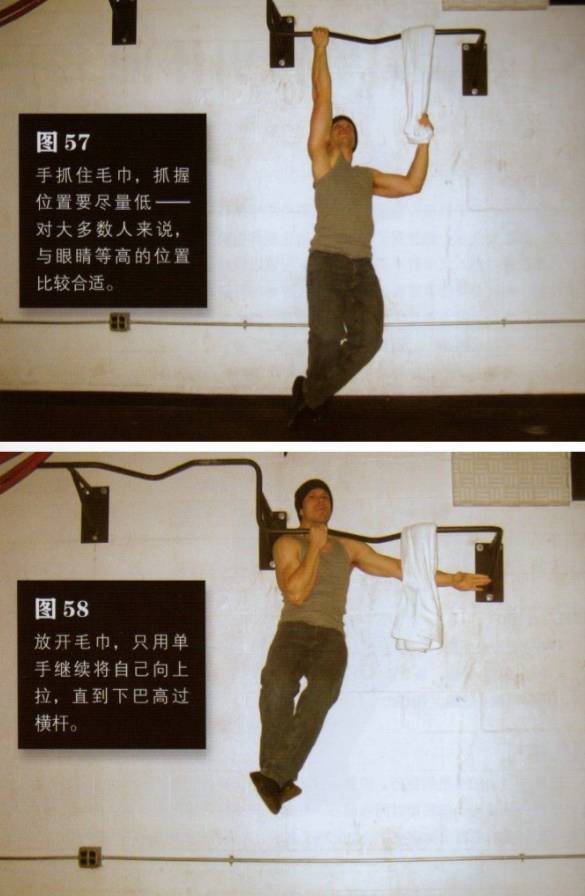|
|十|单臂引体向上|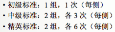|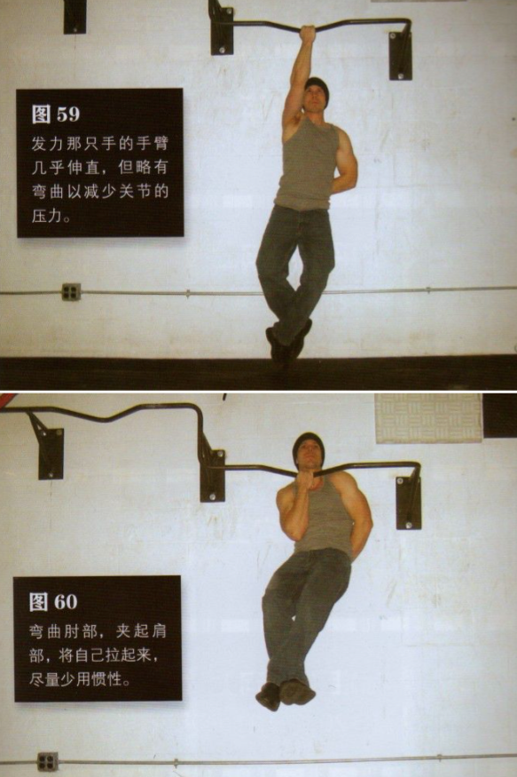|
