# 4-举腿

## 锻炼的主要肌肉群
- 腹直肌（即六块腹肌）
- 腹外斜肌（腹部肌肉）
- 前锯肌（肋骨外侧肌肉）
- 肋间肌（肋骨之间的肌肉）
- 膈肌
- 腹横机
- 股直肌
- 缝匠肌
- 髋部前部的所有复杂肌群
- 抓握所需的肌肉

## 十式
|等级|名称|训练目标|图例|
|---|---|---|---|
|一|坐姿屈膝|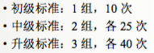|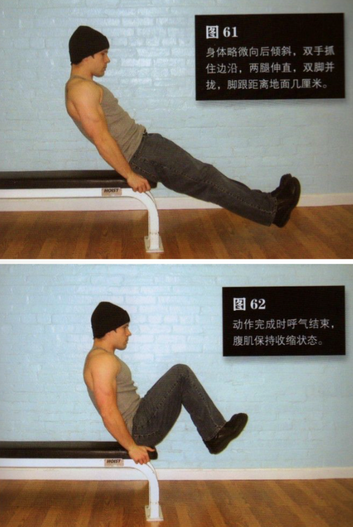|
|二|平卧抬膝|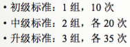|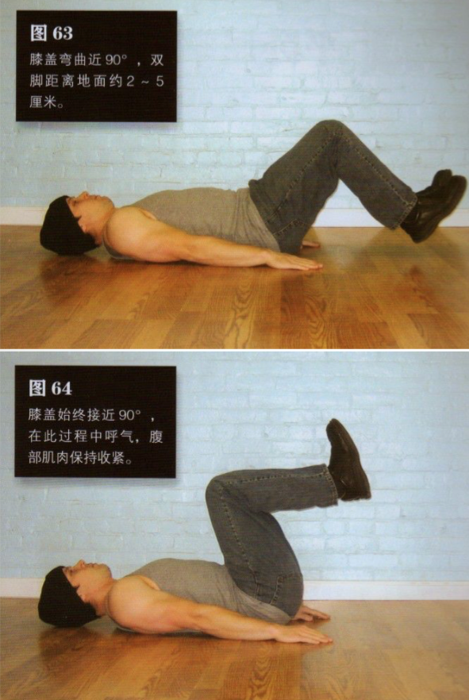|
|三|平卧屈举腿|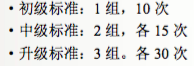|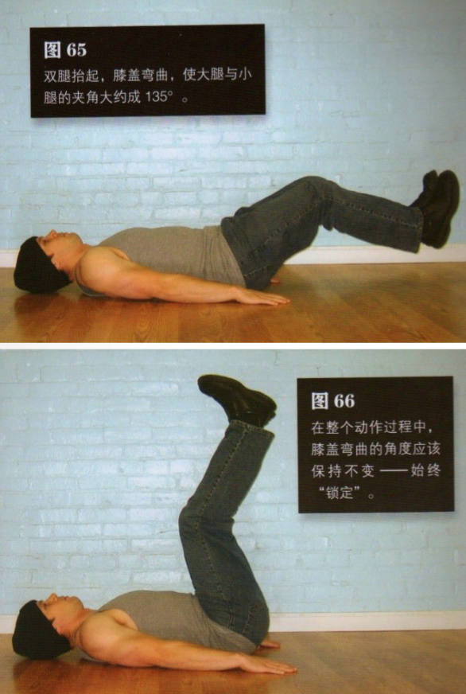|
|四|平卧蛙举腿|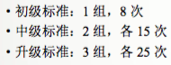|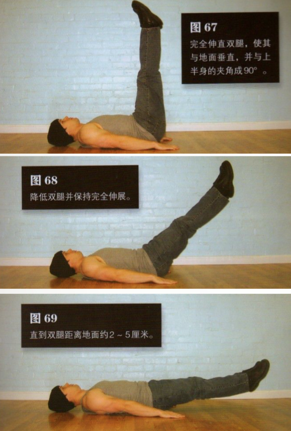|
|五|平卧直举腿|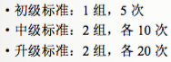|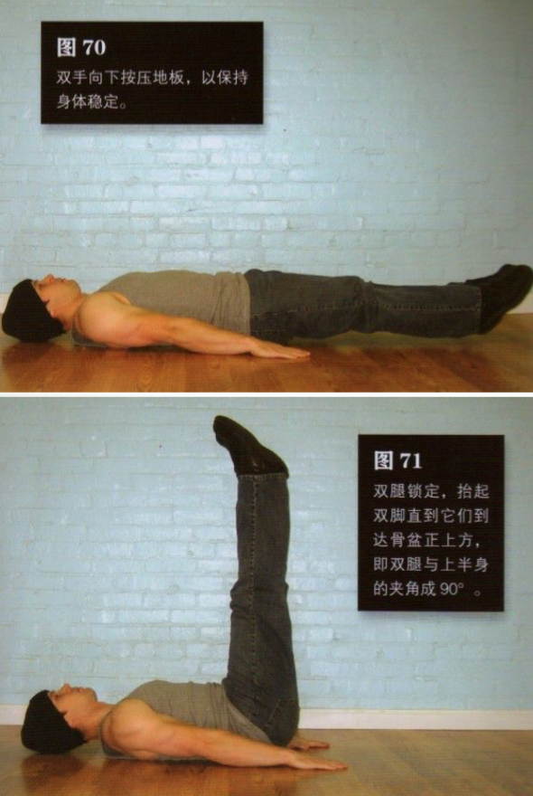|
|六|悬垂屈膝|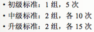|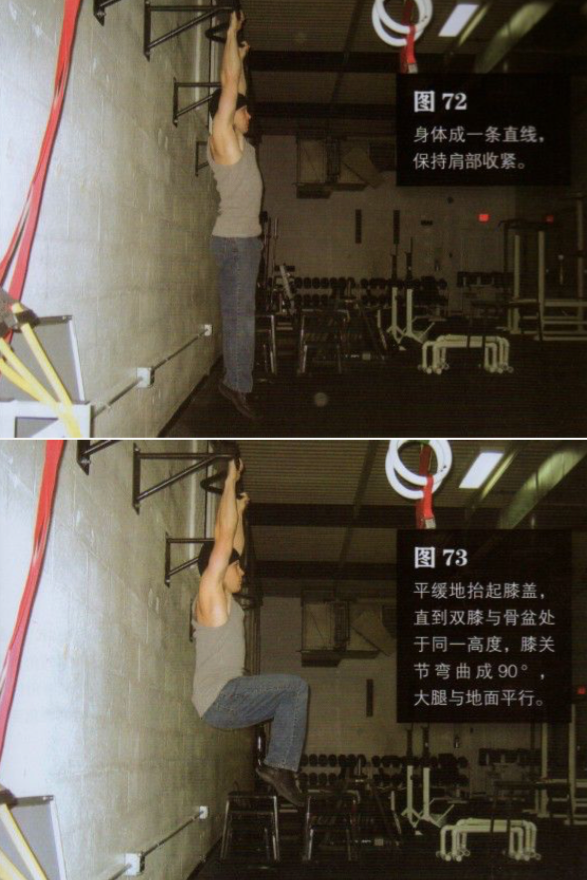|
|七|悬垂屈举腿|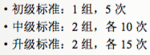|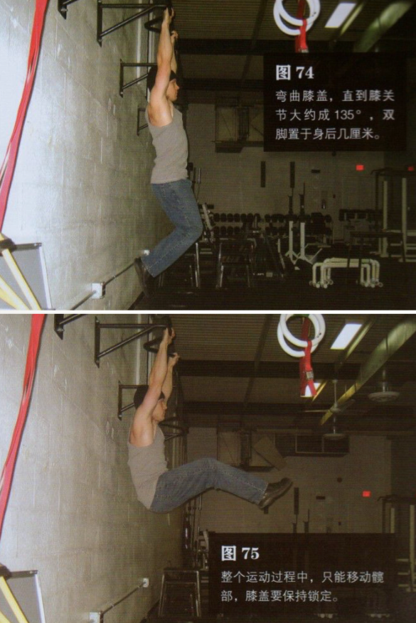|
|八|悬垂蛙举腿|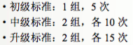|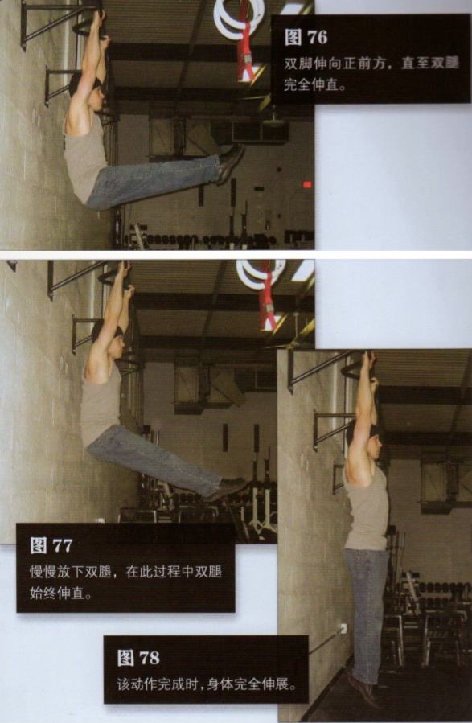|
|九|悬垂半举腿|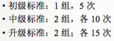|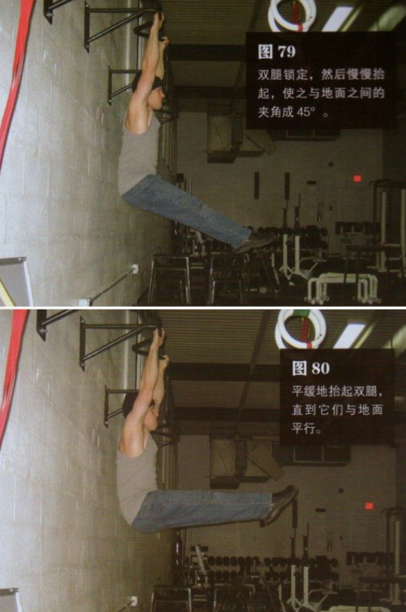|
|十|悬垂直举腿|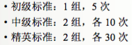|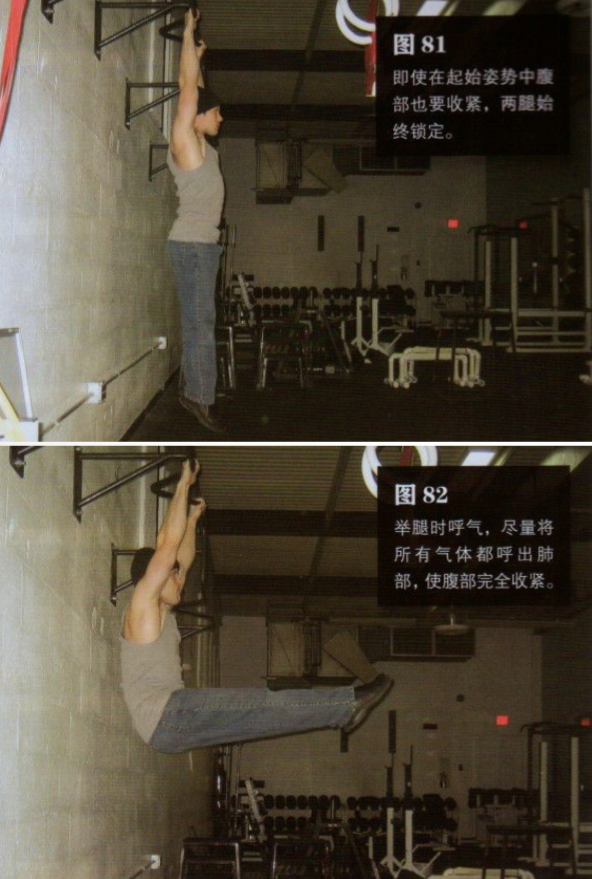|
