# 6-倒立撑

## 锻炼的主要肌肉群
- 肱三头肌
- 肩部
- 上肢带肌
- 斜方肌
- 双手
- 手指
- 前臂

## 十式
|等级|名称|训练目标|图例|
|---|---|---|---|
|一|靠墙顶立|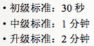|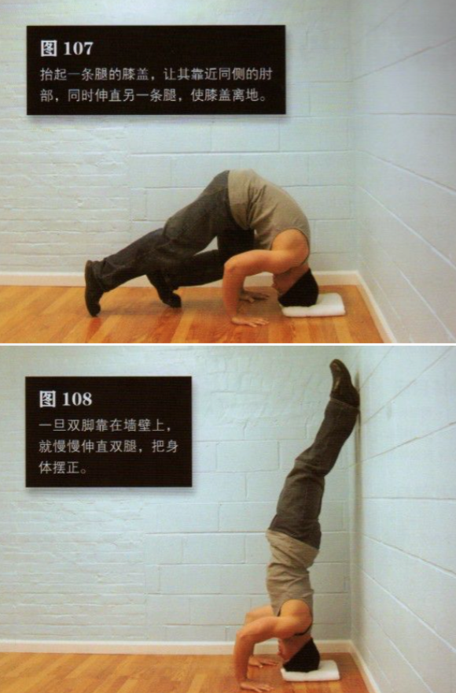|
|二|乌鸦式|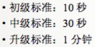|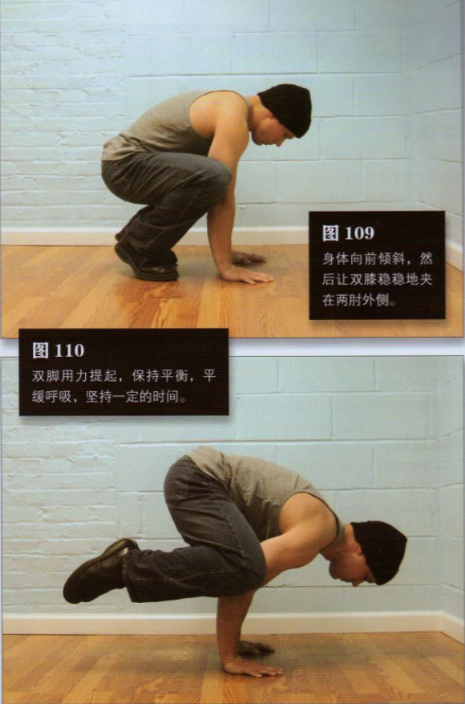|
|三|靠墙倒立|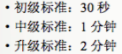|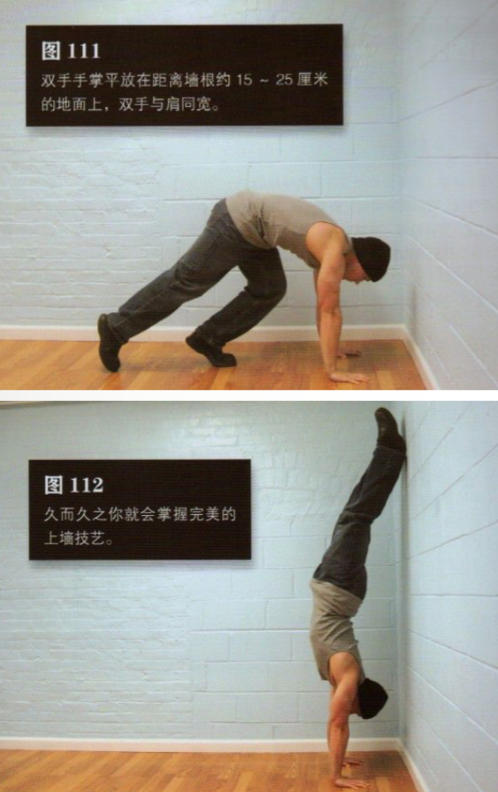|
|四|半倒立撑|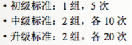|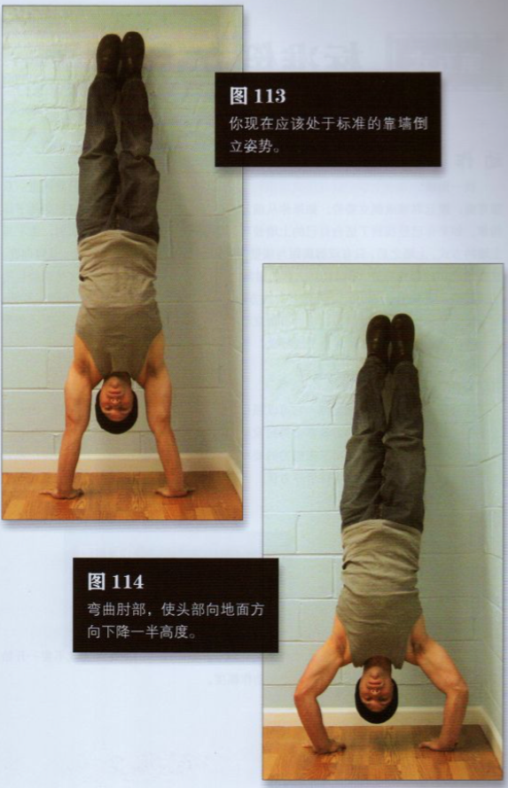|
|五|标准倒立撑|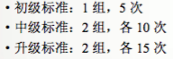|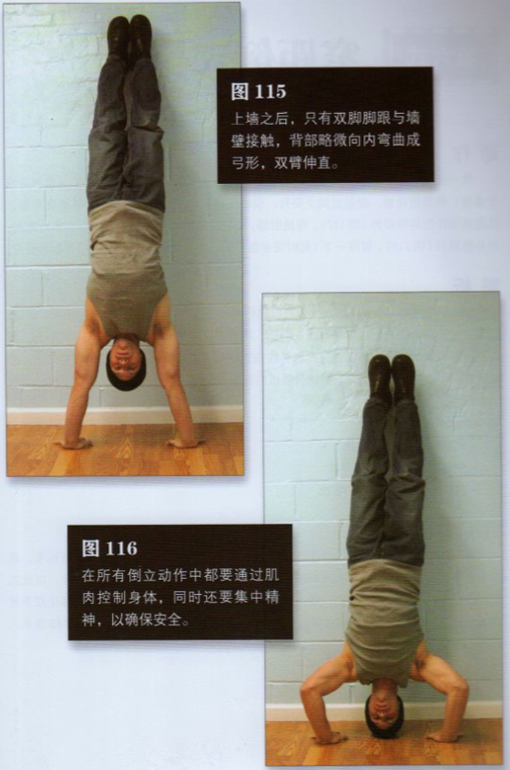|
|六|窄距倒立撑|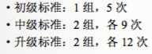|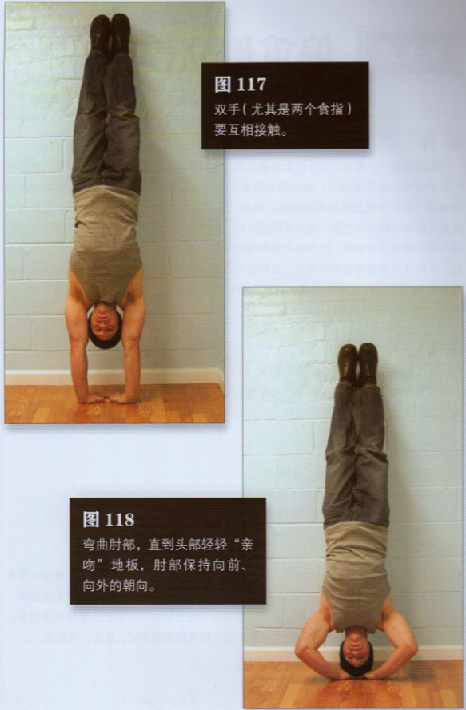|
|七|偏重倒立撑|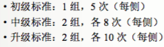|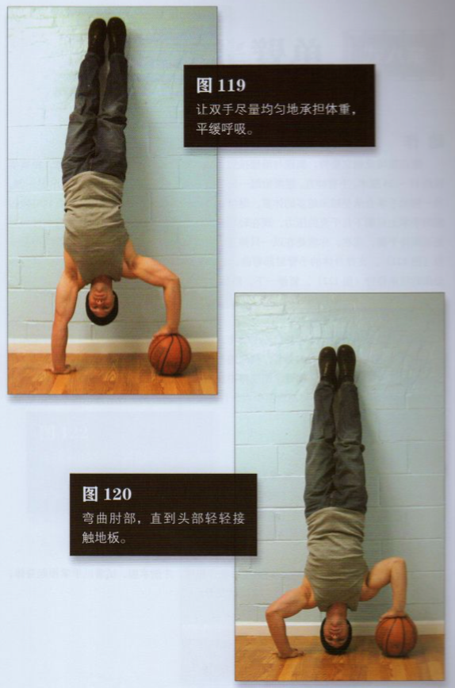|
|八|单臂半倒立撑|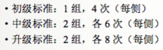|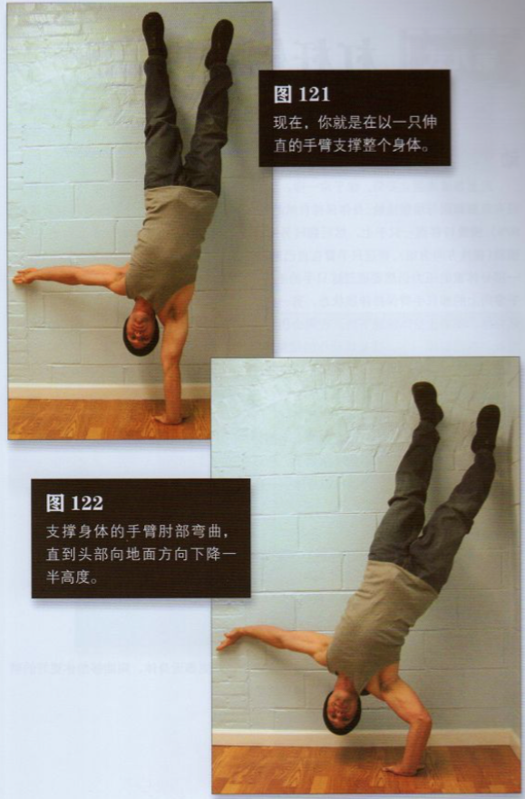|
|九|杠杆倒立撑|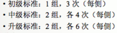|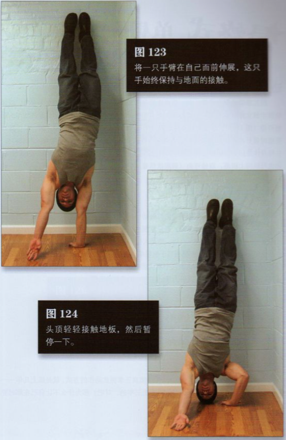|
|十|单臂倒立撑|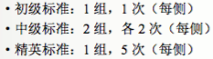|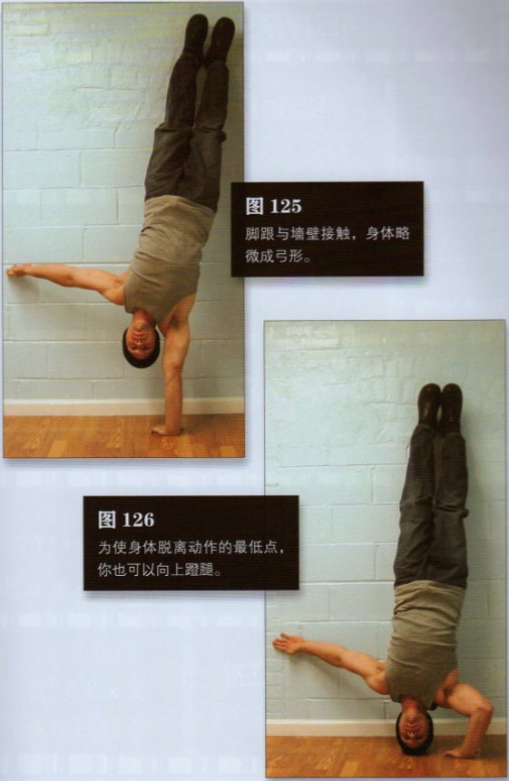|
